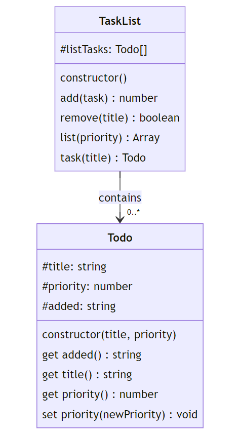

# TaskList App

A minimum viable product (MVP) todo list application implementing an object-oriented design with two main classes.

## Overview

The application consists of two key classes that work together:

- `TaskList`: Manages a collection of todo items
- `Todo`: Represents individual todo items

The relationship between these classes is one-to-many: a single `TaskList` instance can manage multiple `Todo` instances.

## Class Diagram



## Helper Functions

The system requires three helper functions:

### 1. validPositiveInteger(value)
- Accepts: string or numeric value
- Returns: boolean
- Purpose: Validates if the input can be represented as a positive integer

```javascript
validPositiveInteger('10')  // returns true
validPositiveInteger(10)    // returns true
validPositiveInteger('-10') // returns false
validPositiveInteger(0.0)   // returns true (JS coerces to integer)
```

### 2. validatePriority(value)
- Accepts: string or numeric value
- Returns: integer (priority value)
- Valid priorities:
  - LOW (1)
  - MEDIUM (3)
  - HIGH (5)
  - URGENT (7)
- Returns LOW (1) for invalid inputs

```javascript
validatePriority(1)    // returns 1
validatePriority('7')  // returns 7
validatePriority('A')  // returns 1 (invalid input)
```

### 3. todaysDate()
- Returns: string
- Format: 'DD/MM/YYYY HH:MM:SS'
- Purpose: Provides current system datetime

```javascript
todaysDate() // returns e.g., "23/10/2024 09:30:04"
```

## Class Specifications

### Todo Class

Represents a single todo item with three private attributes:
- title
- priority
- added (automatically set on creation)

Example usage:
```javascript
const todo = new Todo('Get Cappuccino', PRIORITY.MEDIUM)
console.log(todo.added)    // '23/10/2024 12:26:26'
console.log(todo.title)    // 'Get Cappuccino'
console.log(todo.priority) // 3
todo.priority = PRIORITY.URGENT
console.log(todo.priority) // 7
```

### TaskList Class

Manages a collection of Todo items with five main methods:

1. **constructor()**: Initializes an empty array to store todos

2. **add(todo)**: 
   - Adds a Todo instance to the list
   - Returns: Number of todos in list

3. **remove(title)**:
   - Removes a todo by title (case insensitive)
   - Returns: boolean (true if removed, false if not found)

4. **list(priority = 0)**:
   - Lists todos, optionally filtered by priority
   - Returns: Array of [added, title, priority] arrays
   - Priority 0 returns all todos

5. **task(title)**:
   - Retrieves a specific todo by title
   - Returns: Todo reference if found
   - Throws: Error if not found (`Task 'title' Not Found`)

Example usage:
```javascript
const taskList = new TaskList()
taskList.add(new Todo('Get Cappuccino', PRIORITY.HIGH))     // returns 1
taskList.add(new Todo('Order Lunch', PRIORITY.MEDIUM))      // returns 2
taskList.list(PRIORITY.MEDIUM)                              // returns matching todos
taskList.task('Order Lunch').priority = PRIORITY.HIGH       // updates priority
taskList.remove('Order Lunch')                              // returns true
```

## Development Guidelines

1. Implement and test helper functions first
2. Use private attributes where possible
3. Implement proper error handling
4. Test thoroughly, including edge cases
5. Refactor for clarity and efficiency
6. Follow standard JavaScript coding conventions